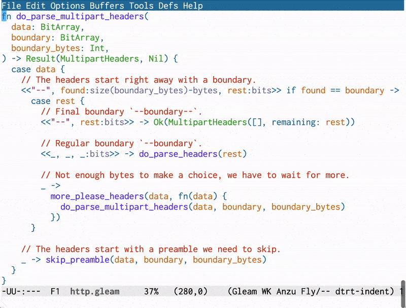

===============================
Tab-Based Indentation Converter
===============================

..
   .. image:: https://melpa.org/packages/tbindent-badge.svg
      :alt: Melpa
      :target: https://melpa.org/#/tbindent

**Seamlessly convert space-based indented files to tab-based indentation for
viewing and editing.**

This package provides **tbindent-mode**, a minor mode which provides the
ability to transparently convert the content of a file indented with a
fixed number of spaces into a buffer which uses tab-based indentation and save
the buffer content back to file with the original space-based indentation
scheme.

Overview
========

**Why would you want to use this?**

- Edit space-based indentation files as if they were tab-based.
- Use it to edit a file using a wider or narrower indentation width.

You can use this minor mode if you'd like to see the indentation with a
different width while viewing or editing its content.  That may appeal to
people that have problems or do not like working with code that use a small
space-based indentation width.  With the rising popularity of space based
indentation with a 2 column indentation width, the need for a work-around
solution increases.

**How does it work?**

Given appropriate conditions, the **tbindent-mode** converts a buffer content
from space-based indentation to pure hard-tabs based indentation.

The conditions are:

- the value of ``tab-width`` must be equal to the indentation value identified
  by the indentation control variable used for the major-mode, such as, for example:

  - ``c-basic-offset`` in C, C++ , D buffers, or
  - ``ada-indent`` for Ada buffers, or
  - ``python-indent-offset`` for Python buffers.

- Those values must also represent the real indentation width used inside the file.

With those conditions met inside the buffer, an indentation step identified by
the indentation control variable corresponds to the tab width and we can now
change the tab-width and the value of the indentation control variable to
change the visual rendering of indentation to be narrower or wider.

Activation/deactivation:

- When turning **tbindent-mode** on:

  - it remembers the original indentation scheme,
  - converts each group of spaces that constitute one indentation step into
    one hard tab and adjust the value of the following buffer local variables:

    - it sets both ``tab-width`` and the variable(s) that controls indentation
      for the buffer's major-mode to the same value, using the variables
      **tbindent-target-indent-widths** customizable user-option defines if any
      or the one(s) currently used,
    - it activates the ``indent-tabs-mode``,
    - it manages the ``fill-column`` value (more on this later).

- When turning **tbindent-mode** off:

  - it converts the content of the buffer back to the original space-based
    indentation scheme.

**Saving To File**

When **tbindent-mode** is active and you save the buffer back to its file, the
mode seamlessly converts the buffer content back to its original space-based
indentation scheme, stores the buffer content into the file and then restore
the tabs-based indentation to let you continue editing the file.

**Undoing**

The tbindent mode excludes all conversions from space-based indentation to
tabs-based from the buffer's undo list. They do not show up as a buffer
modification.  If you think about it, that's really the case anyways; those
conversions are just a visual rendering change, the file is not modified.

**Dynamically changing the indentation width**

While **tbindent-mode** is on, use the **tbindent-set-tab-width** to change
the indentation width.  That command changes the buffer local value of
``tab-width`` and the indentation control variable used by the major mode.
With that command, you can quickly widen or narrow the indentation width in
the buffer.  This modification does **not** and will not affect the content of
the file.

**What about auto-fill mode?**

While **tbindent-mode** is on, a special function controls the value
of ``fill-column``, adjusting its value to take the visual indentation
modification in the buffer into account.  When the auto-fill mode is active,
the text wrapping will occur in the same relative position as it would in the
file with the original space-based indentation.

Customization
=============

All customization are part of the ``tbindent`` customization group, a child of the
``Emacs/Editing/Indent`` group. The following customizable user options are available:

======================================== ========================================================
User-option                              Description
======================================== ========================================================
**tbindent-lighter**                     The minor mode lighter.  Defaults to " **⍈**".

**tbindent-target-indent-widths**        The target indentation width to use for specified major
                                         modes.  This is an alist of cons ``(mode . width)``
                                         cells.

**tbindent-target-indent-width-default** The default indentation width used by **tbindent-mode**
                                         when **tbindent-target-indent-widths** does not hold
                                         the value for the current major mode.

**tbindent-extra-mode-indent-vars**      User-specified indentation variable specifications for modes.

                                         - This is a alist mapping the major mode name to the name of one variable, a list
                                           of variables or a list of ``(vars . offset)``.  This identifies the name of the
                                           indentation control variable or variables used by the mode and if necessary an
                                           width offset applied to the variable: ``var = width + offset``.
                                         - By adding entries into this list, you can add information that complements or
                                           overrides the entries in the hard-coded ``tbindent--mode-indent-vars``.
                                         - For example if you use the old ``ada-mode`` you may want to add the entry that maps it
                                           to ``ada-indent`` variable by adding ``ada-mode`` to the list of modes, associating it with
                                           ``ada-indent`` indentation control variable.
======================================== ========================================================

Using tbindent mode
===================

**Manual Activation/Deactivation**

Manually toggle the minor mode on/off with ``M-x tbindent-mode``.

The minor mode first checks if the current settings meet the appropriate
conditions.  It only activates the minor mode if they are. Otherwise it issues
a user error describing the problem.

**Automatic Activation via major-mode hook**

Add ``tbindent-mode`` in the hook for the major modes were you want it
activated automatically, by doing something like the following:

- For the C programming language major-mode::

    (add-hook 'c-mode-common-hook #'tbindent-mode)

- For Gleam Tree-Sitter based major-mode::

    (add-hook 'gleam-ts-mode-hook #'tbindent-mode)

tbindent Commands
=================

The library provides the following commands:

==================================== ================================================
Command                              Description
==================================== ================================================
**tbindent-mode**                    Toggle the minor mode on/off.

**tbindent-set-tab-width**           Set the tab and indent width used in current
                                     buffer to N.  Prompts for the width; accepts a
                                     value in the [2, 8] range.

                                     - Set the buffer local value of ``tab-width`` and
                                       indent control variable(s) used by the current
                                       buffer.
                                     - Use this command to change the indentation width
                                       when **tbindent-mode** is active.
**Secondary commands:**

tbindent-indent-with-tabs            Convert current buffer to use tabs for
                                     indentation. Prompts for the width; accepts a
                                     value in the [2, 8] range.

                                     - A utility command, used internally by
                                       **tbindent-mode**. Not available independently
                                       when **tbindent-mode** is active.  Use it when
                                       **tbindent-mode** is turned off to manually
                                       convert the space-based indentation into
                                       tabs-based indentation scheme.

tbindent-indent-with-spaces          Convert current buffer back to use space-based
                                     indentation.

                                     - A utility command, used internally by
                                       **tbindent-mode**.  Not available independently
                                       when **tbindent-mode** is active.  Use it when
                                       **tbindent-mode** is turned off, and after you
                                       used ``tbindent-indent-with-tabs`` to convert
                                       the tabs-based indented buffer back into
                                       space-based indented scheme.
==================================== ================================================

Other Packages
==============

- `dtrt-indent`_

  - If you intend to work with files written by others,  the indentation settings
    of those files may well differ from your own.  The `dtrt-indent`_
    package detects the indentation scheme used by a file and adjust the value
    of the indentation control variables accordingly.  This is a great help as
    the first step in getting ready to use the ``tbindent-mode``.

- `PEL`_

  - The `PEL`_ system incorporates code similar to the ``tbindent-mode`` and
    provides other helpful commands for indentation and other Emacs
    topics.  The ``tbindent-mode`` code was first created as part of PEL
    and then I extracted this self-sufficient library from it.  PEL is a much larger
    system with a  customization-centric configuration and extensive PDF table
    based documentation.
    Use a browser that can render PDF (like Firefox) to look at
    the `PEL index PDF`_ and its `⅀ Indentation PDF`_ for more info.

---------------------------------------------------------------------------

.. ---------------------------------------------------------------------------
.. links

.. _dtrt-indent: https://github.com/jscheid/dtrt-indent
.. _PEL: https://github.com/pierre-rouleau/pel#readme
.. _PEL index PDF: https://raw.githubusercontent.com/pierre-rouleau/pel/master/doc/pdf/-index.pdf
.. _⅀ Indentation PDF: https://raw.githubusercontent.com/pierre-rouleau/pel/master/doc/pdf/indentation.pdf
